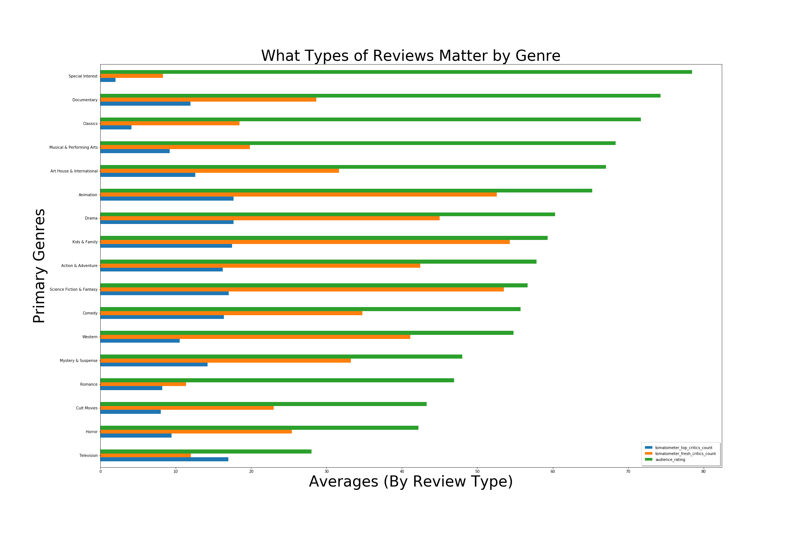

# What Factors Make Films Successful?

**Author**: Samuel Rahwa

March 5, 2021

## Overview

Microsoft stakeholders have noticed their competitors creating original video content. In response, Microsoft has decided to create a new movie studio, but they are unfamiliar with the film sector.  I have been given the task to put together a report on the movie industry that will allow Microsoft stakeholders able to make informed decisions.

## Business Problem

No one factor can make a film successful. Factors like genres, critics reviews, audience ratings, directors and star power can aid in making a successful film.

***
Business Questions:
* What types of genres gross the highest? 
* What types of genres profit the highest?
* What types of reviews matter by genre?
* Who should we acquire as our directors, actors and actresses? 
***

## Data

Two Datasets were used:

* Rotten Tomatoes 

** Various types of Reviews, Directors and Actors/Actresses

** 1129887 Rows

** 28 Columns

* IMDB 

** Genres, Budget and Grossing Data

** 2097 Rows 

** 22 Columns


## Methods

* Missing Data Percentage 
** Dropping Columns that are missing  25 to 30% of it’s  values
* Removing Duplicates
* Using graphs and numerical methods/functions to see what data matters
* Creating a subset dataframes focused on creating value
** Viewed unnecessary data as data doesn’t add value 
* Creating new columns and renaming  columns to access data easier
* Looking at the data to see if it contained any correlation
* Answering my questions with graphs and configurations to the dataframe


## Results

#### Top Grossing Genres:

Domestic: 
* (1) Action 
* (2) Adventure  
* (3) Comedy

Abroad: 
* (1) Action
* (2) Adventure
* (3) Drama

#### Top Profits By Genre:

Domestic: 
* (1) Comedy
* (2) Adventure
* (3) Action

Abroad:
* (1) Action
* (2) Adventure
* (3) Drama 

#### Audience Ratings are the most dominate type of review, for almost every genre. 

#### Multi-Film Directors have issues with runtime and what the audience loves to watch.
(The criteria was a minimum  production of at least 18 films)

#### Audience ratings pointed to multi-film Actors/Actresses were dominated by men, who mainly starred in Action, Adventure and Drama genres.
(The criteria was a minimum of being in at least 25 films)

### Gross vs Profit


### Audience Reviews Dominate


### Multi-film Directors, Actors and Actresses we can acquire 


## Conclusions

A film is multifaceted. One factor is not the sole determinant for why a film will be successful or fail. We can this the correlation matrices. By using the following common factors: genres that gross/profit the most, audience reviews, highest audience approvals for directors, the average directors runtimes and the top actors/actresses to target for our films, we can build a successful launch point for our production studio's success strategy.


## For More Information

Please review our full analysis in [our Jupyter Notebook](../what_factors_make_a_film_successful.ipynb) or our [presentation](../what_factors_make_films_successful_presentation.pdf).

For any additional questions, please contact **Samuel Rahwa at samuelaaronrahwa@gmail.com**

## Repository Structure


```
├── README.md                                                   <- The top-level README for reviewers of this project
├── what_factors_make_a_film_successful.ipynb                   <- Narrative documentation of analysis in Jupyter notebook
├── what_factors_make_films_successful_presentation.pdf         <- PDF version of project presentation
├── data                                                        <- Both sourced externally and generated from code
└── images                                                      <- Both sourced externally and generated from code
```
